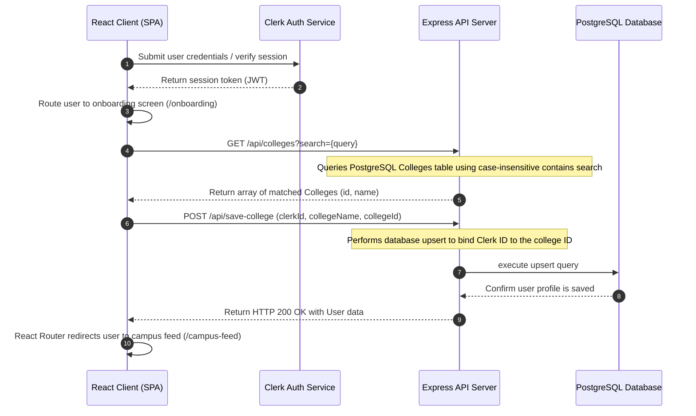
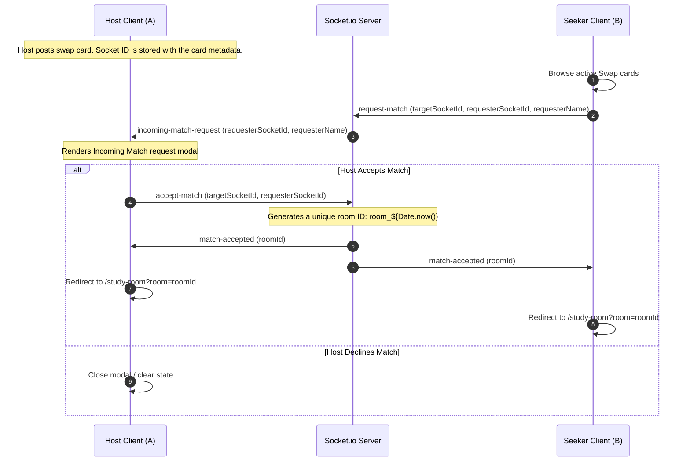
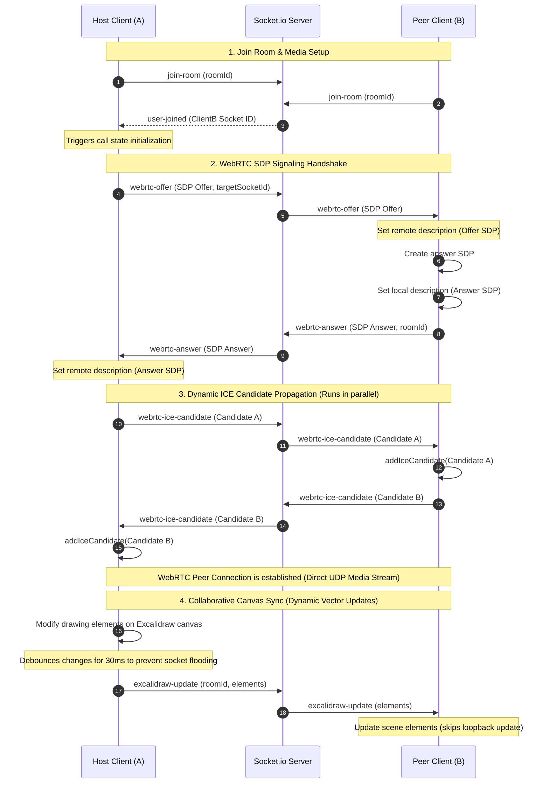
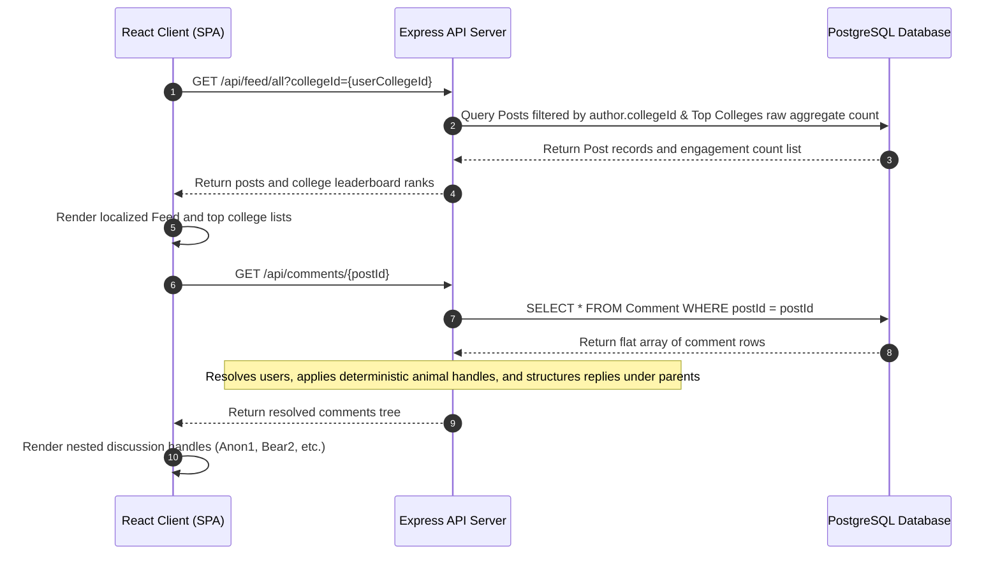

# CLUTCH: Technical Architecture, Network Topology, and Data Flow Manual

This manual provides a highly detailed specification of the network topology, system architecture, runtime protocols, and data-flow sequences of the CLUTCH platform.

---

## 1. System Topology and Network Infrastructure

The platform consists of a React client Single Page Application (SPA), an event-driven Express.js API server, a stateful Socket.io signaling server, and a PostgreSQL database. Communication uses three distinct networking protocols and port mappings:

```
[ Client Browser Sandbox ]
      |
      +--- HTTPS (TCP 5000) ------------> [ Express REST API Engine ] ---- [ Prisma ORM ] ---- [ PostgreSQL (TCP 5432) ]
      |
      +--- WS/WSS (TCP 5000) -----------> [ Socket.io WebSockets ]
      |
      +--- WebRTC Data Plane (UDP) ----> [ Peer Client Browser Sandbox ] (Direct connection routed via STUN lookup)
```

### 1.1 Client Runtime Architecture
* **Interface Layer:** Powered by React 19 and compiled via Vite.
* **Network Handlers:** 
  * Stateless REST calls are handled by the browser's `Fetch` API, targeting port `5000`.
  * Stateful duplex connections are managed via `socket.io-client` on the same port, utilizing a shared WebSocket connection upgrade protocol.
  * Real-time media streams bypass the application server entirely once established, running peer-to-peer over UDP sockets negotiated dynamically.

### 1.2 Server & Runtime Environment
* **Express.js API Engine:** Powered by Node.js, running an event loop to handle API routes, static file routing for user uploads via disk systems, and JSON payloads.
* **Socket.io WebSocket Layer:** Runs in-process with the HTTP server on port `5000`. It acts as a signaling channel, room coordinator, and real-time state router.
* **CORS Restrictions:** Express middleware limits connections to trusted origins:
  * Origin: `http://localhost:5173`
  * Allowed Headers: Standard headers, including authorization tokens and session IDs.
  * Credentials: Enabled to support cookies and token handshakes.

### 1.3 Database and Persistence Tier
* **PostgreSQL Engine:** Runs as a relational database, listening on TCP port `5432`.
* **Prisma Client ORM:** Embedded in the backend server. It manages connection pools, handles queries, enforces model constraints, and maps entity relations.

---

## 2. End-to-End System Execution Flow Chart

This diagram charts the logical execution flow of the entire CLUTCH application lifecycle, detailing routing paths, controller interventions, and signaling transitions.

```mermaid
flowchart TD
    Start([Student Opens Platform]) --> Auth{Session Token Valid?}
    
    Auth -- No --> SignModal[Clerk Authentication Modal] --> SignSuccess[Verify Session & Emit JWT] --> NewUser{Profile Exists in DB?}
    Auth -- Yes --> HomeRoute[Redirect to Home Route /]
    
    NewUser -- No --> Onboard[Route to Onboarding Screen /onboarding]
    NewUser -- Yes --> HomeRoute
    
    Onboard --> QueryColleges[Search Box: Fetch matching colleges]
    QueryColleges --> REST1[GET /api/colleges?search=keyword]
    REST1 --> DBColleges[(Colleges Table Query)]
    DBColleges --> ReturnColleges[Display filtered institutional list]
    
    ReturnColleges --> SelectCollege[User Selects Institution]
    SelectCollege --> REST2[POST /api/save-college]
    REST2 --> DBUserUpsert[Prisma upsert binds Clerk ID to College ID]
    DBUserUpsert --> SetAffiliation[Assign collegeName and collegeId to User record]
    SetAffiliation --> HomeRoute
    
    %% Main Dashboard Division
    HomeRoute --> Dashboard{Select Platform Module}
    
    %% Pathway A: Social Feed
    Dashboard -->|Social Hub| FeedRoute[Route to /campus-feed]
    FeedRoute --> LoadFeed[GET /api/feed/all?collegeId=X]
    LoadFeed --> QueryPosts[Prisma filters posts matching user collegeId]
    QueryPosts --> SQLRank[queryRaw aggregates active post counts per institution]
    SQLRank --> RenderFeed[Render post list and institutional leaderboard]
    
    RenderFeed --> NewPost[User creates a post]
    NewPost --> FileInput{Has image attachment?}
    FileInput -- Yes --> FormPayload[Append text & binary to FormData] --> MulterDir[Post /api/feed/create via Multer filesystem write] --> DBPost[Insert Post record with imageUrl pointer]
    FileInput -- No --> PostPayload[POST content payload] --> DBPost
    
    RenderFeed --> ViewComments[User expands comments section /post/:postId]
    ViewComments --> GETComments[GET /api/comments/:postId]
    GETComments --> DBComments[(Comments Table Select)]
    DBComments --> ModAlgorithm[Compute user ID modulo for animal handles: getAnonymousName]
    ModAlgorithm --> TreeTransformer[Map flat adjacency list comments into recursive JSON tree]
    TreeTransformer --> RenderComments[Display nested threaded comments tree]
    
    %% Pathway B: Study Swap Matchmaker
    Dashboard -->|Study Swap Engine| SwapRoute[Route to /study-swap]
    SwapRoute --> PostSwap[User posts swap request offer, need, category, urgency]
    PostSwap --> BindSocket[Bind active socket.id to Swap record in state]
    
    SwapRoute --> BrowseSwaps[Peer browses DSA & Skill swap cards]
    BrowseSwaps --> InitiateMatch[Peer clicks Match on Target Card]
    InitiateMatch --> WebSocketMatch[Emit request-match with target socket.id & requester metadata]
    WebSocketMatch --> HostModal[Relay incoming-match-request to Host UI]
    HostModal --> HostDecision{Host accepts match?}
    
    HostDecision -- No --> TerminateMatch[Close matchmaking modal]
    HostDecision -- Yes --> AcceptSocket[Emit accept-match from Host]
    AcceptSocket --> CreateRoom[Server instantiates Room ID: room_timestamp]
    CreateRoom --> SocketRedirect[Emit match-accepted to both clients]
    SocketRedirect --> RoomRoute[Redirect both clients to /study-room?room=roomId]
    
    %% Pathway C: Virtual Study Room
    Dashboard -->|Virtual Workspace Direct Access| RoomRoute
    RoomRoute --> JoinChannel[Emit join-room subscribing socket to room channel]
    JoinChannel --> MediaAccess[Request hardware access: getUserMedia]
    
    %% WebRTC sub-flow
    MediaAccess --> RTCStart[Create RTCPeerConnection & register local tracks]
    RTCStart --> STUNQuery[Query STUN server stun.l.google.com to discover NAT IPs]
    STUNQuery --> GenerateIce[onicecandidate triggers webrtc-ice-candidate signaling exchange]
    
    RTCStart --> UserJoinSignal[Listen to user-joined event]
    UserJoinSignal --> SignalSDP[Handshake: Create Offer SDP -> setLocalDescription -> emit webrtc-offer]
    SignalSDP --> AcceptSDP[Peer receives offer -> setRemoteDescription -> Create Answer SDP -> emit webrtc-answer]
    AcceptSDP --> RemoteDescription[Host receives answer -> setRemoteDescription]
    
    GenerateIce & RemoteDescription --> P2PConnected[WebRTC Peer-to-Peer UDP direct stream established]
    
    %% Collaboration / Canvas features inside room
    RoomRoute --> CanvasInit[Initialize Excalidraw Engine]
    CanvasInit --> CanvasChange[Stroke/drawing event occurs]
    CanvasChange --> CycleCheck{Triggered by network socket event?}
    CycleCheck -- Yes --> SkipLoop[Reset isUpdatingFromSocket flag and end iteration]
    CycleCheck -- No --> DebounceCanvas[Debounce element update payload for 30ms]
    DebounceCanvas --> EmitCanvas[Emit excalidraw-update to room channel]
    EmitCanvas --> BroadcastCanvas[Server broadcasts coordinates to other peer sockets]
    
    RoomRoute --> ChatPanelInit[Initialize Chat panel]
    ChatPanelInit --> SendMessage[User sends chat text]
    SendMessage --> EmitMessage[Emit send-message with roomId]
    EmitMessage --> ServerChat[Server broadcasts receive-message to room]
    ServerChat --> MessageBubbleMemo[MessageBubble React.memo updates UI bubble list]
```



---

## 3. Core Functional Subsystems Detailed Sequence Flows

### 3.1 Onboarding and Profile Association Flow
This flow creates a user record in the local database and links it to an verified college ID during their first login.



### 3.2 Peer Matchmaking Flow (Study Swap Engine)
This flow connects two active peer sockets, creates a virtual room, and redirects both users to a shared workspace.



### 3.3 Collaborative Study Room & WebRTC Connection Flow
Once redirected to `/study-room`, this flow establishes the peer-to-peer media stream and coordinates the shared Excalidraw whiteboard.



### 3.4 Campus Feed, Leaderboard & Discussion Tree Flow
This flow maps social feeds, calculates college leaderboards via raw SQL, and resolves flat comments into a nested tree structure.



---

## 4. Technology Stack and Dependencies

| Layer | Dependencies | Details |
| :--- | :--- | :--- |
| **Frontend** | React 19, Vite, TailwindCSS (v4), React Router Dom (v7), `@clerk/clerk-react` | Client-side interface rendering, application routing, and authentication wrappers. |
| **Real-time Engine**| Socket.io-client, RTCPeerConnection (WebRTC), `@excalidraw/excalidraw` | Event-driven socket connections, media negotiation, and canvas serialization. |
| **Backend API** | Node.js, Express 5, Socket.io, Multer, `xlsx` | HTTP interface routing, media binary uploads, and Excel parsing. |
| **Database Engine** | PostgreSQL, Prisma Client | Relational data persistence, schema modeling, and raw analytical querying. |

---

## 5. Detailed Repository and Directory Architecture

The system is configured as a client-server project containing isolated backend and frontend workspaces. Below is the itemized breakdown of structural files and directories, clarifying files, logic layers, and internal components.

### 5.1 Backend Project Directory (`/backend`)

The backend codebase manages HTTP routing, WebSocket event handlers, relational database connectivity, and administrative setup scripts.

*   **`college_name/`**
    *   `college_codes.xlsx`: Binary Excel worksheet holding the master list of academic institutions with unique numerical identifiers (`Code`) and textual labels (`College Name`).
*   **`prisma/`**
    *   `schema.prisma`: The primary configuration of the database layout, mapping target entities, relations, cascades, indices, and generation adapters.
*   **`src/`**
    *   **`controllers/`**
        *   `CommentlogicAPI.js`: Manages relational comments. Features:
            *   `addComment`: Inserts comments. If the calling user entity doesn't exist locally, it executes an automated schema creation utilizing Clerk parameters.
            *   `getPostComments`: Resolves comments associated with a `postId`. Translates the database's flat array schema into a recursive hierarchical tree structure, calculating pseudonym indexes via user key mod limits.
            *   `editComment`: Handles comment update requests, mutating stored text fields.
        *   `postController.js`: Controls post creation and retrieval. Features:
            *   `createPost`: Processes text contents and local file targets, executing image URL assignments.
            *   `getAllPosts`: Resolves post objects dynamically using client-driven filtering criteria (limiting content to corresponding `collegeId` keys) and resolves top active institutions using aggregate RAW queries.
    *   **`middleware/`**
        *   `authMiddleware.js`: Houses middleware hook slots for intercepting request streams, analyzing headers, and validating identity tokens.
    *   **`routes/`**
        *   `auth.js`: Declares paths to save user profile changes (upserting user instances on selected college fields) and retrieve user attributes using Clerk IDs.
        *   `college.js`: Maps institutional searches, routing input keywords to query PostgreSQL tables with case-insensitive contains-operators.
        *   `comments.js`: Standardizes routes (`POST /`, `GET /:postId`, `PUT /:id`) mapping comments to controller methods.
        *   `feed.js`: Endpoints (`POST /create`, `GET /all`) controlling post workflows and binding multer file interceptors.
    *   **`services/`**
        *   `multer.js`: Service configured to map multipart form submissions. Creates directory `/uploads/` on bootstrap, generates safe randomized file outputs via filesystem utilities, and implements strict size filters.
    *   **`sockets/`**
        *   `chatHandler.js`: Socket callback mapper. Coordinates workspace connections, parses instant message buffers, registers signaling handlers (`webrtc-offer`, `webrtc-answer`, `webrtc-ice-candidate`), and handles call rejection states.
        *   `whiteboardHandler.js`: Intercepts Excalidraw updates, broadcasting serial coordinates directly to client sets bound to the active roomId.
    *   **`app.js`**: Initializes the Express application, configures CORS policies, establishes JSON parsers, registers static file exposure on `/uploads`, and mounts core routing paths under `/api`.
    *   **`server.js`**: App entrypoint. Creates the base HTTP server, instantiates Socket.io with origin policies, links socket handlers, and binds the stack to the configured TCP socket.
*   **`seed.js`**: Read-and-load utility using `xlsx` to parse `college_codes.xlsx` and insert the institutional elements into the PostgreSQL `Colleges` table while skipping duplicates.

---

### 5.2 Frontend Client Directory (`/clutch-client`)

The frontend application code builds pages and components inside a single-page app framework.

*   **`public/`**
    *   Contains static resources, images, and localized browser manifest assets.
*   **`src/`**
    *   **`api/`**
        *   `College.jsx`: Renders the onboarding college selection view. Conducts continuous database searches as users enter terms and dispatches POST updates to link accounts to institutions.
        *   `CommentsMain.jsx`: Renders comments under individual posts, orchestrating tree nodes, replies, comment creation inputs, and edits.
        *   `dsa.js` / `swap.js`: Utility files handling structural constants and formatting styles.
    *   **`components/`**
        *   `AIGapQuiz.jsx`: Embeds generative review elements and question forms.
        *   `ChatBox.jsx`: Reusable sidebar container for standard text messaging.
        *   `Navbar.jsx`: Application header providing links to pages (Home, Study Swap, Study Room, Feed, Profile) and mounting Clerk sign-in controls.
        *   `SwapCard.jsx`: Abstract UI block formatting learning assets, seeking competencies, and urgency tags.
        *   `Whiteboard.jsx`: Layout block hosting the cooperative workspace.
        *   **`campus-feed/`**
            *   `Feed-post.jsx`: Pop-up window for post creation. Prepares multiline text areas, local file input bindings, and uploads posts using `FormData` envelopes to POST endpoints.
            *   `Filter.jsx` / `Recent.jsx`: Filters feed streams by time or category flags.
        *   **`studyroom/`**
            *   `ChatPanel.jsx`: Highly optimized chat container. Highlights:
                *   *Reconciliation Optimization:* Employs a specialized `MessageBubble` sub-component wrapped inside `React.memo` to skip bubble re-rendering when new items are appended.
                *   *Reliable Identification:* Resolves socket ID variables using reference listeners (`socketIdRef`) to prevent initialization race-conditions.
                *   *Disk I/O Throttling:* Debounces local storage persistence writes by 500ms using side-effect cleanup routines.
                *   *Memory Bounds:* Enforces a strict limit of 100 entries on the messages list using slicing operations to optimize browser DOM size.
            *   `IncomingCallModal.jsx`: Pop-up overlay warning users of incoming RTC connection offers, mapping accepts and declines.
            *   `VideoPanel.jsx`: Layout block showing local and remote video objects side-by-side using references to bind active media stream tracks.
            *   `Whiteboard.jsx`: Mounts the `@excalidraw/excalidraw` editor. Listens to update events, intercepts modifications, breaks update loop cycles via internal flag variables, and uses debounced socket emissions (30ms) to throttle updates.
    *   **`hooks/`**
        *   `useWebRTC.js`: Custom signaling hook managing RTC states. Negotiates call requests, binds local hardware inputs to RTCPeerConnection, processes ICE candidates, and manages SDP offer/answer states.
    *   **`pages/`**
        *   `Campus-Feed.jsx`: Renders the institutional feed page. Displays community posts, and features post creation tools and engagement analytics boards.
        *   `CommentSection.jsx`: Page view managing comments, resolving individual posts and handling structured nested threads.
        *   `Home.jsx`: The application dashboard showing user profiles, active study pairings, and core feature entries.
        *   `Leaderboard.jsx`: Displays top institutional rankings based on community engagement counts.
        *   `Profile.jsx`: Allows users to view identity records, registered college affiliations, and active post histories.
        *   `SignIn.jsx` / `SignUp.jsx`: Pages wraps rendering Clerk auth flow components.
        *   `StudyRoom.jsx`: The layout manager for collaborative sessions. Features a draggable separator handle implementing mouse-tracking width calculation formulas to dynamically resize panels.
        *   `StudySwap.jsx`: Renders active skill lists and DSA queries. Integrates forms to submit swap posts and manages incoming matchmaking invitation modals.
    *   **`socket/`**
        *   `socket.js`: Exports a singleton instance of the Socket.io client connection pointed to the backend, enabling shared socket links across independent components.
    *   **`App.jsx`**: Main route manager. Maps paths using React Router and coordinates application state.
    *   **`index.css`**: Global stylesheet initializing custom CSS rules and mounting Tailwind utilities.
    *   **`main.jsx`**: Application entrypoint configuring Clerk wraps and mounting the DOM root node.

---

## 6. Relational Model Schema Specification

The relational database is constructed in PostgreSQL via the following Prisma model definition:

```prisma
model User {
  id            Int       @id @default(autoincrement())
  clerkId       String?   @unique
  username      String    @unique
  email         String    @unique
  passwordHash  String
  collegeName   String? 
  collegeId     Int?      
  createdAt     DateTime  @default(now())
  posts         Post[]
  likes         Like[]
  comments      Comment[]
}

model Post {
  id         Int        @id @default(autoincrement())
  title      String
  content    String?
  imageUrl   String?
  createdAt  DateTime   @default(now())
  authorId   Int
  author     User       @relation(fields: [authorId], references: [id], onDelete: Cascade)
  likes      Like[]
  comments   Comment[]
}

model Like {
  id        Int      @id @default(autoincrement())
  postId    Int
  userId    Int
  createdAt DateTime @default(now())
  post      Post     @relation(fields: [postId], references: [id], onDelete: Cascade)
  user      User     @relation(fields: [userId], references: [id], onDelete: Cascade)

  @@unique([postId, userId])
}

model Comment {
  id        Int       @id @default(autoincrement())
  postId    Int
  userId    Int
  content   String
  parentId  Int?      
  parent    Comment?  @relation("CommentReplies", fields: [parentId], references: [id], onDelete: Cascade)
  replies   Comment[] @relation("CommentReplies")
  createdAt DateTime  @default(now())
  post      Post      @relation(fields: [postId], references: [id], onDelete: Cascade)
  user      User      @relation(fields: [userId], references: [id], onDelete: Cascade)
}

model Colleges {
   id       Int     @id
   name     String  @unique
}
```

---

## 7. Sockets Protocol Reference

WebSocket operations implement strict interfaces mapping directly to the backend signaling handlers:

| Event Namespace | Direct Origin | Payload Signature | Description |
| :--- | :--- | :--- | :--- |
| `join-room` | Client ➔ Server | `roomId: string` | Registers client socket descriptor into the targeted virtual room. |
| `send-message` | Client ➔ Server | `{ roomId: string, text: string, sender: string }` | Transmits text packet to active room socket channels. |
| `request-match` | Client ➔ Server | `{ targetSocketId: string, requesterSocketId: string, requesterName: string }` | Relays request to match targeting specific peer instance. |
| `accept-match` | Client ➔ Server | `{ targetSocketId: string, requesterSocketId: string }` | Creates random room ID and emits redirection message. |
| `excalidraw-update`| Client ➔ Server | `{ roomId: string, elements: any[] }` | Relays visual array updates to other room subscribers. |
| `webrtc-offer` | Bidirectional | `{ roomId: string, offer: RTCSessionDescriptionInit, targetSocketId?: string }` | Forwards offer parameters to configure remote descriptor. |
| `webrtc-answer` | Bidirectional | `{ roomId: string, answer: RTCSessionDescriptionInit }` | Relays answered session parameter maps to host client. |
| `webrtc-ice-candidate`| Bidirectional| `{ roomId: string, candidate: RTCIceCandidateInit }` | Propagates network candidate data structures. |
| `reject-call` | Client ➔ Server | `{ targetSocketId: string }` | Relays call rejection to terminate caller execution context. |
| `call-rejected` | Server ➔ Client | (Empty) | Updates initiating client connection state to failed. |

---

## 8. Developer Environment Setup

### 8.1 Database Initialization
1. Navigate to the backend directory:
   ```bash
   cd backend
   ```
2. Install external package dependencies:
   ```bash
   npm install
   ```
3. Populate database configuration inside `.env`:
   ```env
   DATABASE_URL="postgresql://<db_user>:<db_password>@<db_host>:<db_port>/<db_name>?schema=public"
   ```
4. Run schema migration scripts to configure PostgreSQL tables:
   ```bash
   npx prisma migrate dev --name init
   ```
5. Run the Excel parsing seed module to configure institutional records:
   ```bash
   node seed.js
   ```

### 8.2 Frontend Initialization
1. Navigate to the client directory:
   ```bash
   cd ../clutch-client
   ```
2. Run installation scripts:
   ```bash
   npm install
   ```
3. Configure the local environment file `.env`:
   ```env
   VITE_CLERK_PUBLISHABLE_KEY="your_clerk_publishable_key"
   ```

### 8.3 Development Execution
Spawn both application servers concurrently:

* **API & WebSocket Signaling Instance (Backend):**
  ```bash
  cd backend
  npm run dev
  ```
* **Vite Development Service (Client):**
  ```bash
  cd clutch-client
  npm run dev
  ```
Navigate to `http://localhost:5173`. Authorize the client via the Clerk screen to request permissions and access pages.