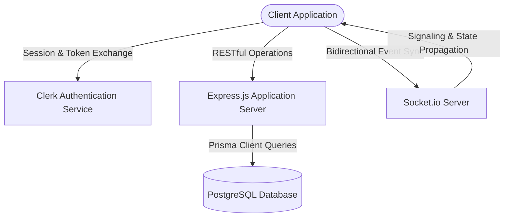

# CLUTCH

## Platform Architecture and Technical Specification

CLUTCH is a decentralized, peer-to-peer campus learning network and community application built for students. It facilitates academic exchange, peer matchmaking, real-time audio/visual communication, collaborative vector whiteboards, and localized discussions restricted by college affiliation.

---

## 1. System Topology

The software architecture consists of a client-server paradigm with real-time bidirectional messaging and third-party authentication integration.



---

## 2. Core Functional Subsystems

### 2.1 Identity Management and Institutional Affiliation Onboarding
* **Authentication Provider:** User registration and session state are managed via Clerk. During registration, the client token is verified on the backend, and user state is synchronized.
* **Institutional Mapping Database:** The system references a collection of Indian academic institutions. This dataset is initialized using the `indian-colleges` schema registry and seeded via database migrations.
* **Affiliation Resolution:** During onboarding, users complete a case-insensitive query lookup against the `Colleges` table, binding their Postgres `User` record to a specific `collegeId` and `collegeName`.

### 2.2 Peer-to-Peer Matchmaking (Study Swap Engine)
* **Match Definition:** Users declare learning assets they possess ("offers") and competencies they seek ("needs"), categorized under either generalized skills or Data Structures and Algorithms (DSA).
* **Asynchronous Match Propagation:** The matching engine uses Socket.io to route direct pairing requests. When a user initiates a match:
  1. A `request-match` socket event is dispatched to the target socket ID containing the requester's metadata.
  2. The target client displays a modal allowing prompt acceptance or rejection of the matchmaking request.
  3. Acceptance triggers an `accept-match` socket event on the server, generating a unique cryptographically pseudorandom room ID (`room${Date.now()}`) and redirecting both clients to the collaborative workspace route `/study-room?room=<roomId>`.

### 2.3 Real-Time Collaborative Study Room
* **Collaborative Vector Workspace:** Integration of `@excalidraw/excalidraw` for canvas operations. All structural operations (shape addition, stroke adjustments, text modifications) generate a canvas change payload. This payload is intercepted and broadcasted dynamically via socket events (`excalidraw-update`) to synchronize client views without local DB persistence.
* **WebRTC Signaling and Media Streaming:** Direct peer-to-peer communication is established using `RTCPeerConnection` with the following pipeline:
  1. The client queries the `stun:stun.l.google.com:19302` STUN server to discover its public-facing IP and port configurations (ICE Candidates).
  2. Media streams (local camera and microphone input) are resolved via the `navigator.mediaDevices.getUserMedia` API.
  3. Web socket signaling coordinates the exchange of session descriptions (SDP Offer/Answer) and ICE candidates using signaling paths: `webrtc-offer`, `webrtc-answer`, and `webrtc-ice-candidate`.
* **Dynamic Layout Engine:** A resizer mechanism monitors workspace pointer movement, recalculating relative flexbox container dimensions to allow resizing of the whiteboard canvas relative to the media/chat panel.

### 2.4 Anonymous Campus Feed and Nested Discussions
* **Affiliation Restrictive Querying:** The backend filters social feed posts based on the `collegeId` attribute of the logged-in user, restricting the visibility of posts to members of the same institution.
* **Binary Media Processing:** Uploaded post images are handled via `Multer` disk storage configuration, writing incoming streams directly to `/uploads` on the server file system and returning local URLs.
* **Hierarchical Tree Commenting:** Comments are represented in the relational database as an adjacency list. The `Comment` schema maintains a self-referencing relationship:
  * A comment may optional link to a `parentId`.
  * The API fetches comments in linear fashion and processes the result set into a recursive JSON tree, clustering replies under parent objects.
* **Pseudonymization Algorithm:** To ensure user privacy, usernames are obfuscated in comment sections. A deterministic function evaluates user ID integers against a modulo constraint mapping to a static array of animal handles:
  $$\text{pseudonym} = \text{animals}[\text{userId} \pmod{\text{len}(\text{animals})}] + \text{userId}$$
* **Engagement Analytics Leaderboard:** An analytics pipeline evaluates post counts per college using a raw SQL aggregation query (`$queryRaw`) mapping the counts to rank active institutions:
  ```sql
  SELECT u."collegeId", COUNT(p.id) as "postCount"
  FROM "Post" p
  JOIN "User" u ON p."authorId" = u.id
  WHERE u."collegeId" IS NOT NULL
  GROUP BY u."collegeId"
  ORDER BY "postCount" DESC
  LIMIT 5
  ```

---

## 3. Technology Stack and Dependencies

| Layer | Dependencies | Details |
| :--- | :--- | :--- |
| **Frontend** | React 19, Vite, TailwindCSS (v4), React Router Dom (v7), `@clerk/clerk-react` | Client-side interface rendering, application routing, and authentication wrappers. |
| **Real-time Engine**| Socket.io-client, RTCPeerConnection (WebRTC), `@excalidraw/excalidraw` | Event-driven socket connections, media negotiation, and canvas serialization. |
| **Backend API** | Node.js, Express 5, Socket.io, Multer, `xlsx` | HTTP interface routing, media binary uploads, and Excel parsing. |
| **Database Engine** | PostgreSQL, Prisma Client | Relational data persistence, schema modeling, and raw analytical querying. |

---

## 4. Detailed Repository and Directory Architecture

The system is configured as a client-server project containing isolated backend and frontend workspaces. Below is the itemized breakdown of structural files and directories, clarifying files, logic layers, and internal components.

### 4.1 Backend Project Directory (`/backend`)

The backend codebase manages HTTP routing, WebSocket event handlers, relational database connectivity, and administrative setup scripts.

*   **`college_name/`**
    *   `college_codes.xlsx`: Binary Excel worksheet holding the master list of academic institutions with unique numerical identifiers (`Code`) and textual labels (`College Name`).
*   **`prisma/`**
    *   `schema.prisma`: The primary configuration of the database layout, mapping target entities, relations, cascades, indices, and generation adapters.
*   **`src/`**
    *   **`controllers/`**
        *   `CommentlogicAPI.js`: Manages relational comments. Features:
            *   `addComment`: Inserts comments. If the calling user entity doesn't exist locally, it executes an automated schema creation utilizing Clerk parameters.
            *   `getPostComments`: Resolves comments associated with a `postId`. Translates the database's flat array schema into a recursive hierarchical tree structure, calculating pseudonym indexes via user key mod limits.
            *   `editComment`: Handles comment update requests, mutating stored text fields.
        *   `postController.js`: Controls post creation and retrieval. Features:
            *   `createPost`: Processes text contents and local file targets, executing image URL assignments.
            *   `getAllPosts`: Resolves post objects dynamically using client-driven filtering criteria (limiting content to corresponding `collegeId` keys) and resolves top active institutions using aggregate RAW queries.
    *   **`middleware/`**
        *   `authMiddleware.js`: Houses middleware hook slots for intercepting request streams, analyzing headers, and validating identity tokens.
    *   **`routes/`**
        *   `auth.js`: Declares paths to save user profile changes (upserting user instances on selected college fields) and retrieve user attributes using Clerk IDs.
        *   `college.js`: Maps institutional searches, routing input keywords to query PostgreSQL tables with case-insensitive contains-operators.
        *   `comments.js`: Standardizes routes (`POST /`, `GET /:postId`, `PUT /:id`) mapping comments to controller methods.
        *   `feed.js`: Endpoints (`POST /create`, `GET /all`) controlling post workflows and binding multer file interceptors.
    *   **`services/`**
        *   `multer.js`: Service configured to map multipart form submissions. Creates directory `/uploads/` on bootstrap, generates safe randomized file outputs via filesystem utilities, and implements strict size filters.
    *   **`sockets/`**
        *   `chatHandler.js`: Socket callback mapper. Coordinates workspace connections, parses instant message buffers, registers signaling handlers (`webrtc-offer`, `webrtc-answer`, `webrtc-ice-candidate`), and handles call rejection states.
        *   `whiteboardHandler.js`: Intercepts Excalidraw updates, broadcasting serial coordinates directly to client sets bound to the active roomId.
    *   **`app.js`**: Initializes the Express application, configures CORS policies, establishes JSON parsers, registers static file exposure on `/uploads`, and mounts core routing paths under `/api`.
    *   **`server.js`**: App entrypoint. Creates the base HTTP server, instantiates Socket.io with origin policies, links socket handlers, and binds the stack to the configured TCP socket.
*   **`seed.js`**: Read-and-load utility using `xlsx` to parse `college_codes.xlsx` and insert the institutional elements into the PostgreSQL `Colleges` table while skipping duplicates.

---

### 4.2 Frontend Client Directory (`/clutch-client`)

The frontend application code builds pages and components inside a single-page app framework.

*   **`public/`**
    *   Contains static resources, images, and localized browser manifest assets.
*   **`src/`**
    *   **`api/`**
        *   `College.jsx`: Renders the onboarding college selection view. Conducts continuous database searches as users enter terms and dispatches POST updates to link accounts to institutions.
        *   `CommentsMain.jsx`: Renders comments under individual posts, orchestrating tree nodes, replies, comment creation inputs, and edits.
        *   `dsa.js` / `swap.js`: Utility files handling structural constants and formatting styles.
    *   **`components/`**
        *   `AIGapQuiz.jsx`: Embeds generative review elements and question forms.
        *   `ChatBox.jsx`: Reusable sidebar container for standard text messaging.
        *   `Navbar.jsx`: Application header providing links to pages (Home, Study Swap, Study Room, Feed, Profile) and mounting Clerk sign-in controls.
        *   `SwapCard.jsx`: Abstract UI block formatting learning assets, seeking competencies, and urgency tags.
        *   `Whiteboard.jsx`: Layout block hosting the cooperative workspace.
        *   **`campus-feed/`**
            *   `Feed-post.jsx`: Pop-up window for post creation. Prepares multiline text areas, local file input bindings, and uploads posts using `FormData` envelopes to POST endpoints.
            *   `Filter.jsx` / `Recent.jsx`: Filters feed streams by time or category flags.
        *   **`studyroom/`**
            *   `ChatPanel.jsx`: Highly optimized chat container. Highlights:
                *   *Reconciliation Optimization:* Employs a specialized `MessageBubble` sub-component wrapped inside `React.memo` to skip bubble re-rendering when new items are appended.
                *   *Reliable Identification:* Resolves socket ID variables using reference listeners (`socketIdRef`) to prevent initialization race-conditions.
                *   *Disk I/O Throttling:* Debounces local storage persistence writes by 500ms using side-effect cleanup routines.
                *   *Memory Bounds:* Enforces a strict limit of 100 entries on the messages list using slicing operations to optimize browser DOM size.
            *   `IncomingCallModal.jsx`: Pop-up overlay warning users of incoming RTC connection offers, mapping accepts and declines.
            *   `VideoPanel.jsx`: Layout block showing local and remote video objects side-by-side using references to bind active media stream tracks.
            *   `Whiteboard.jsx`: Mounts the `@excalidraw/excalidraw` editor. Listens to update events, intercepts modifications, breaks update loop cycles via internal flag variables, and uses debounced socket emissions (30ms) to throttle updates.
    *   **`hooks/`**
        *   `useWebRTC.js`: Custom signaling hook managing RTC states. Negotiates call requests, binds local hardware inputs to RTCPeerConnection, processes ICE candidates, and manages SDP offer/answer states.
    *   **`pages/`**
        *   `Campus-Feed.jsx`: Renders the institutional feed page. Displays community posts, and features post creation tools and engagement analytics boards.
        *   `CommentSection.jsx`: Page view managing comments, resolving individual posts and handling structured nested threads.
        *   `Home.jsx`: The application dashboard showing user profiles, active study pairings, and core feature entries.
        *   `Leaderboard.jsx`: Displays top institutional rankings based on community engagement counts.
        *   `Profile.jsx`: Allows users to view identity records, registered college affiliations, and active post histories.
        *   `SignIn.jsx` / `SignUp.jsx`: Pages wraps rendering Clerk auth flow components.
        *   `StudyRoom.jsx`: The layout manager for collaborative sessions. Features a draggable separator handle implementing mouse-tracking width calculation formulas to dynamically resize panels.
        *   `StudySwap.jsx`: Renders active skill lists and DSA queries. Integrates forms to submit swap posts and manages incoming matchmaking invitation modals.
    *   **`socket/`**
        *   `socket.js`: Exports a singleton instance of the Socket.io client connection pointed to the backend, enabling shared socket links across independent components.
    *   **`App.jsx`**: Main route manager. Maps paths using React Router and coordinates application state.
    *   **`index.css`**: Global stylesheet initializing custom CSS rules and mounting Tailwind utilities.
    *   **`main.jsx`**: Application entrypoint configuring Clerk wraps and mounting the DOM root node.

---

## 5. Relational Model Schema Specification

The relational database is constructed in PostgreSQL via the following Prisma model definition:

```prisma
model User {
  id            Int       @id @default(autoincrement())
  clerkId       String?   @unique
  username      String    @unique
  email         String    @unique
  passwordHash  String
  collegeName   String? 
  collegeId     Int?      
  createdAt     DateTime  @default(now())
  posts         Post[]
  likes         Like[]
  comments      Comment[]
}

model Post {
  id         Int        @id @default(autoincrement())
  title      String
  content    String?
  imageUrl   String?
  createdAt  DateTime   @default(now())
  authorId   Int
  author     User       @relation(fields: [authorId], references: [id], onDelete: Cascade)
  likes      Like[]
  comments   Comment[]
}

model Like {
  id        Int      @id @default(autoincrement())
  postId    Int
  userId    Int
  createdAt DateTime @default(now())
  post      Post     @relation(fields: [postId], references: [id], onDelete: Cascade)
  user      User     @relation(fields: [userId], references: [id], onDelete: Cascade)

  @@unique([postId, userId])
}

model Comment {
  id        Int       @id @default(autoincrement())
  postId    Int
  userId    Int
  content   String
  parentId  Int?      
  parent    Comment?  @relation("CommentReplies", fields: [parentId], references: [id], onDelete: Cascade)
  replies   Comment[] @relation("CommentReplies")
  createdAt DateTime  @default(now())
  post      Post      @relation(fields: [postId], references: [id], onDelete: Cascade)
  user      User      @relation(fields: [userId], references: [id], onDelete: Cascade)
}

model Colleges {
   id       Int     @id
   name     String  @unique
}
```

---

## 6. Real-Time Socket Event Protocol

Communication over the WebSocket interface executes under the following specific contract:

| Event Identifier | Data Origin | Payload Signature | Description |
| :--- | :--- | :--- | :--- |
| `join-room` | Client ➔ Server | `roomId: string` | Instructs the server to subscribe the socket to the defined room channel. |
| `send-message` | Client ➔ Server | `{ roomId: string, text: string, sender: string }` | Relays an instant chat message to all connected clients in the room. |
| `request-match` | Client ➔ Server | `{ targetSocketId: string, requesterSocketId: string, requesterName: string }` | Forwards a matchmaking invitation to the specific target socket. |
| `accept-match` | Client ➔ Server | `{ targetSocketId: string, requesterSocketId: string }` | Triggers unique channel instantiation and routes target and host to the workspace. |
| `excalidraw-update`| Client ➔ Server | `{ roomId: string, elements: any[] }` | Broadcasts drawing vector array delta updates to other room participants. |
| `webrtc-offer` | Bidirectional | `{ roomId: string, offer: RTCSessionDescriptionInit, targetSocketId?: string }` | Initiates WebRTC handshaking by sending the caller's Session Description Protocol parameters. |
| `webrtc-answer` | Bidirectional | `{ roomId: string, answer: RTCSessionDescriptionInit }` | Complete WebRTC handshaking by returning the receiver's Session Description Protocol parameters. |
| `webrtc-ice-candidate`| Bidirectional| `{ roomId: string, candidate: RTCIceCandidateInit }` | Disseminates discovered network routing pathways to negotiate network traversal. |
| `reject-call` | Client ➔ Server | `{ targetSocketId: string }` | Signal that the targeted peer has rejected the incoming stream negotiation. |
| `call-rejected` | Server ➔ Client | (Empty) | Dispatched to caller indicating session negotiation termination. |

---

## 7. Deployment and Initialization Setup

### 7.1 System Requirements
* Node.js runtime environment (version >= 18.0.0)
* npm packager (version >= 9.0.0)
* PostgreSQL instance

### 7.2 Database Setup and Migration
1. Navigate to the backend directory:
   ```bash
   cd backend
   ```
2. Install dependencies:
   ```bash
   npm install
   ```
3. Initialize the `.env` configuration file inside `backend/`:
   ```env
   DATABASE_URL="postgresql://<db_user>:<db_password>@<db_host>:<db_port>/<db_name>?schema=public"
   ```
4. Perform Prisma migration to update PostgreSQL database structure:
   ```bash
   npx prisma migrate dev --name init
   ```
5. Seed database with the institutional registry via Excel sheet input parsing:
   ```bash
   node seed.js
   ```

### 7.3 Client Application Setup
1. Navigate to the client directory:
   ```bash
   cd ../clutch-client
   ```
2. Run package installation:
   ```bash
   npm install
   ```
3. Configure the local environment file `.env` inside `clutch-client/`:
   ```env
   VITE_CLERK_PUBLISHABLE_KEY="your_clerk_publishable_key"
   ```

### 7.4 Execution Commands
Run the development servers concurrently in separate terminals:

* **Backend API and WebSocket Instance:**
  ```bash
  cd backend
  npm run dev
  ```
* **Frontend Vite Service:**
  ```bash
  cd clutch-client
  npm run dev
  ```

Upon active execution, navigate to `http://localhost:5173`. Ensure authorization steps are completed to allow access to authenticated API endpoints.